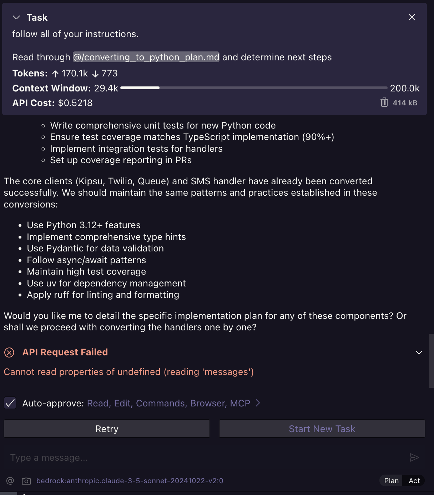

# Issue

When using AWS Bedrock and starting in Plan mode on a new task, I get this initial error when I switch to Act

Clicking "Retry" works and it continues on as normal. Must being some issue with initalizing a messages array or something

## also add prompt caching via anthropic-ai/sdk for bedrock